<style>
citation {
  font-size: 4px;
}
</style>

<!--  Version 1.0-0

      This version of the slides is taken directly from Mine Çetinkaya-Rundel's lecture slides
      posted on OpenIntro.org in .pptx and .gdslides format. Simply moved to Rmd. 

      A large part of the HTML/CSS formatting is janky, and could be cleaned up. 
      Feel free to issue a  pull request if you love HTML and CSS and want to fix this up.

      - wburr, Nov 10, 2017
-->

<!-- This is Chapter 5.1 in the text, slides by Mine Cetinkaya-Rundel -->
# Line Fitting, Residuals and Correlation

## Modeling Numerical Variables

In this unit we will learn to quantify the relationship between two numerical variables, as well as modeling numerical response variables using a numerical or categorical explanatory variable.

## Poverty versus High School graduation rate

The **scatterplot** below shows the relationship between HS graduate rate in all 50 US states and DC and the percent of residents who live below the poverty line (income below $23,050 for a family of 4 in 2012).

<center>
```{r, out.width = "450px", echo = FALSE}
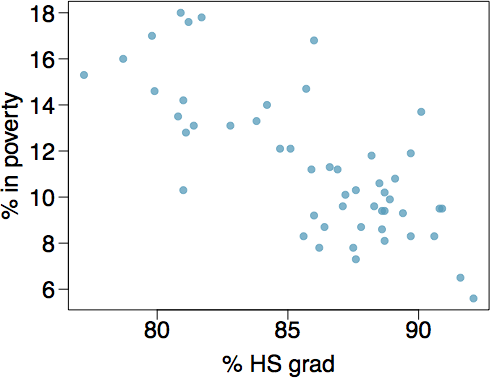
```
</center>

## Poverty versus High School graduation rate

<center>
```{r, out.width = "450px", echo = FALSE}

```
</center>

**Response Variable**?

## Poverty versus High School graduation rate

<center>
```{r, out.width = "450px", echo = FALSE}

```
</center>

**Response Variable**?
Percentage in poverty

## Poverty versus High School graduation rate

<center>
```{r, out.width = "450px", echo = FALSE}

```
</center>

**Response Variable**?
Percentage in poverty

**Explanatory Variable**?

## Poverty versus High School graduation rate

<center>
```{r, out.width = "450px", echo = FALSE}

```
</center>

**Response Variable**?
Percentage in poverty

**Explanatory Variable**?
Percentage of HS graduates

## Poverty versus High School graduation rate

<center>
```{r, out.width = "450px", echo = FALSE}

```
</center>

**Response Variable**?
Percentage in poverty

**Explanatory Variable**?
Percentage of HS graduates

**Relationship**?

## Poverty versus High School graduation rate

<center>
```{r, out.width = "450px", echo = FALSE}

```
</center>

**Response Variable**?
Percentage in poverty

**Explanatory Variable**?
Percentage of HS graduates

**Relationship**?
Linear, negative, moderately strong

## Quantifying the Relationship

* **Correlation** describes the *strength* of the *linear* association between the two variables

## Quantifying the Relationship

* **Correlation** describes the *strength* of the *linear* association between the two variables
* Takes on values between $-1$ and $+1$ (inclusive)

## Quantifying the Relationship

* **Correlation** describes the *strength* of the *linear* association between the two variables
* Takes on values between $-1$ and $+1$ (inclusive)
* A value of $0$ indicates no linear association

## Guessing the Correlation

Which of the following is the best guess for the correlation between percentage in poverty and percentage of HS graduates?

<div style = "float:left; position: relative;">
* 0.6
* -0.75
* -0.1
* 0.02
* -1.5
</div>
<div style = "float:right;position: relative;">
```{r, echo=FALSE, out.width = "450px"}
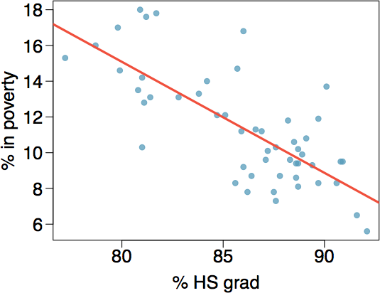
```
</div>


## Guessing the Correlation

Which of the following is the best guess for the correlation between percentage in poverty and percentage of HS graduates?

<div style = "float:left; position: relative;">
* 0.6
* **-0.75**
* -0.1
* 0.02
* -1.5
</div>
<div style = "float:right;position: relative;">
```{r, echo=FALSE, out.width = "450px"}

```
</div>


## Guessing the Correlation (2)

Which of the following is the best guess for the correlation between 
percentage in povery and percentage of female householder.

<div style = "float:left; position: relative;">
* 0.1
* -0.6
* -0.4
* 0.9
* 0.5
</div>
<div style = "float:right;position: relative;">
```{r, echo=FALSE, out.width = "450px"}
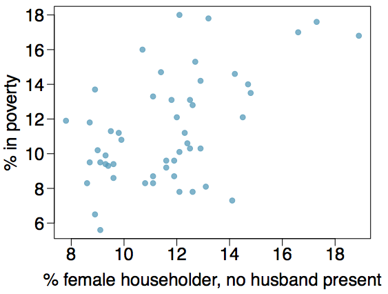
```
</div>

## Guessing the Correlation (2)

Which of the following is the best guess for the correlation between 
percentage in povery and percentage of female householder.

<div style = "float:left; position: relative;">
* 0.1
* -0.6
* -0.4
* 0.9
* **0.5**
</div>
<div style = "float:right;position: relative;">
```{r, echo=FALSE, out.width = "450px"}

```
</div>

## Assessing the Correlation

Which of the following has the strongest correlation, i.e., the correlation coefficient closest to $-1$ or $+1$.

<center>
```{r, echo = FALSE, out.width = "550px"}
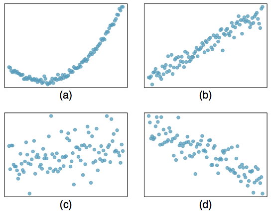
```
</center>

## Assessing the Correlation

<center>
```{r, echo = FALSE, out.width = "450px"}

```
</center>

**Option (b)**. While (a) clearly 'tracks', it's not actually *linear*. 

<!-- This is Chapter 5.2 in the text, slides by Mine Cetinkaya-Rundel -->

# Fitting a line by least squares regression

## Eyeballing the line

<div style = "float:left; position: relative;">
Which of the following appears to be the line that best fits the linear relationship between percentage in poverty and percentage of HS grad? Choose one.
</div>
<div style = "float:right;position: relative;">
```{r, echo=FALSE, out.width = "450px"}
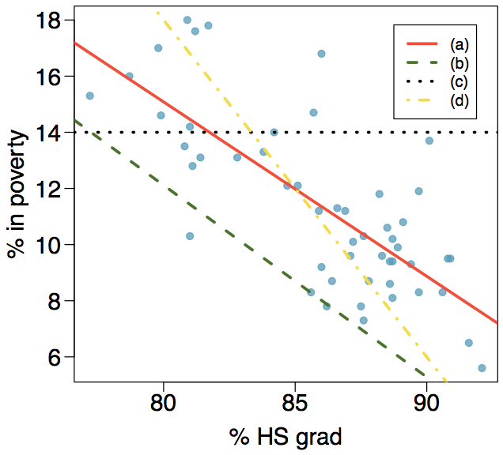
```
</div>

## Eyeballing the linear

<div style = "float:left; position: relative;">
Which of the following appears to be the line that best fits the linear relationship between percentage in poverty and percentage of HS grad? Choose one.

The best fit appears to be **(a)** (over (d)). (b) and (c) aren't good fits at all.
</div>
<div style = "float:right;position: relative;">
```{r, echo=FALSE, out.width = "450px"}

```
</div>

## Residuals

**Residuals** are the leftovers from the model fit. 

$$
\text{Data} = \text{Fit} + \text{Residuals}
$$

<center>
```{r, echo=FALSE, out.width = "450px"}
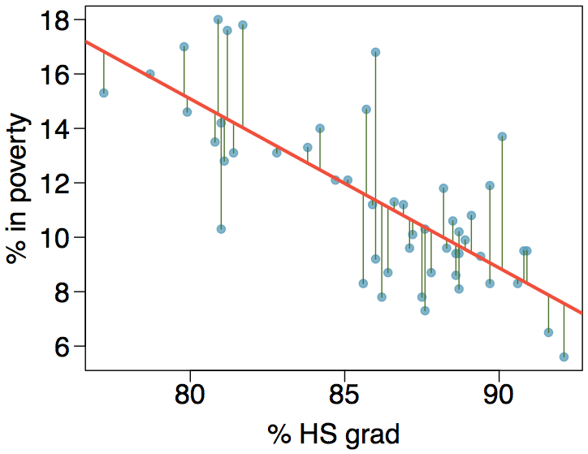
```
</center>

## Residuals (ctd.)

**Residuals** are the difference between the observed ($y_i$) and the predicted ($\hat{y}_i$). We label these as $e_i$.

$$
e_i = y_i - \hat{y}_i
$$

**Note**: the other way is **not** correct! We always take observed *minus* predicted, not the other way around.

## Residuals (ctd.)

<center>
```{r, echo=FALSE, out.width = "450px"}
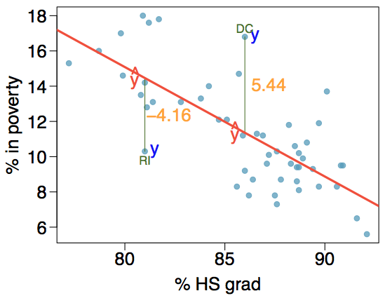
```
</center>

The labeled points indicate that:

* % living in poverty in DC is 5.44% more than predicted.
* % living in poverty in RI is 4.16% less than predicted.

## A measure for the best line

* We want a line that has small residuals

## A measure for the best line

* We want a line that has small residuals
    - **Option 1**: minimize the sum of the absolute values of the residuals,
  $$
  |e_1| + |e_2| + \cdots + |e_n|
  $$

## A measure for the best line

* We want a line that has small residuals
    - **Option 1**: minimize the sum of the absolute values of the residuals,
  $$
  |e_1| + |e_2| + \cdots + |e_n|
  $$
    - **Option 2**: minimize the sum of the *squared* residuals (*least squares*)
  $$
  e_1^2 + e_2^2 + \cdots + e_n^2
  $$

## A measure for the best line

* We want a line that has small residuals
    - **Option 1**: minimize the sum of the absolute values of the residuals,
  $$
  |e_1| + |e_2| + \cdots + |e_n|
  $$
    - **Option 2**: minimize the sum of the *squared* residuals (*least squares*)
  $$
  e_1^2 + e_2^2 + \cdots + e_n^2
  $$
* Why least squares?

## A measure for the best line

* We want a line that has small residuals
    - **Option 1**: minimize the sum of the absolute values of the residuals,
  $$
  |e_1| + |e_2| + \cdots + |e_n|
  $$
    - **Option 2**: minimize the sum of the *squared* residuals (*least squares*)
  $$
  e_1^2 + e_2^2 + \cdots + e_n^2
  $$
* Why least squares?
    - Most commonly used
  
## A measure for the best line

* We want a line that has small residuals
    - **Option 1**: minimize the sum of the absolute values of the residuals,
  $$
  |e_1| + |e_2| + \cdots + |e_n|
  $$
    - **Option 2**: minimize the sum of the *squared* residuals (*least squares*)
  $$
  e_1^2 + e_2^2 + \cdots + e_n^2
  $$
* Why least squares?
    - Most commonly used
    - Easier to compute by hand, and with software
 
## A measure for the best line

* We want a line that has small residuals
    - **Option 1**: minimize the sum of the absolute values of the residuals,
  $$
  |e_1| + |e_2| + \cdots + |e_n|
  $$
    - **Option 2**: minimize the sum of the *squared* residuals (*least squares*)
  $$
  e_1^2 + e_2^2 + \cdots + e_n^2
  $$
* Why least squares?
    - Most commonly used
    - Easier to compute by hand, and with software
    - In many applications, a residual twice as large is more than twice **as bad**

## The least squares line

<center>
```{r, out.width = "750px", echo = FALSE}
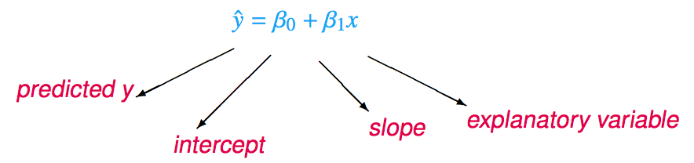
```
</center>

**Notation**:

* Intercept
    - Parameter: $\beta_0$
    - Point estimate: $b_0$
* Slope
    - Parameter: $\beta_1$
    - Point estimate: $b_1$

## Given $\ldots$

<center>
```{r, out.width = "850px", echo = FALSE}
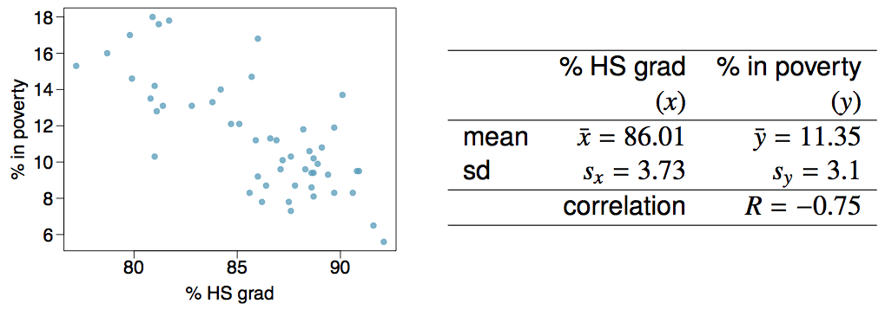
```
</center>

## Slope

The slope of the regression line (remember: $y = mx + b$) can be calculated as

$$
b_1 = \frac{s_y}{s_x} R
$$

In context:

$$
b_1 = \frac{3.1}{3.73} \cdot -0.75 = -0.62
$$

**Interpretation**: for each additional percentage point in HS graduation rate, we would expect the percentage living in poverty to be lower on average by 0.62% points.

## Intercept

The intercept is where the regression line intersects the y-axis. The calculation of the intercept uses the fact the a regression line always passes through ($\bar{x}, \bar{y}$).

<center>
$$
b_0 = \bar{y} - b_1 \bar{x}
$$
</center>

<center>
```{r, out.width = "750px", echo = FALSE}
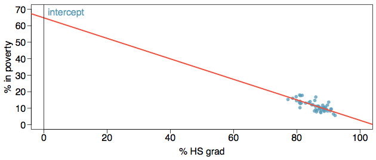
```
</center>

## Intercept

<center>
$$
b_0 = \bar{y} - b_1 \bar{x}
$$

```{r, out.width = "650px", echo = FALSE}

```
</center>

We calculate:
$$
b_0 = 11.35 - (-0.62) \cdot 86.01 = 64.68
$$

## Practice

Which of the following is the correct interpretation of the intercept?

* For each % point increase in HS graduation rates, the % living in poverty is expected to increase on average by 64.68%.
* For each % point decrease in HS graduation rate, the % living in poverty is expected to increase on average by 64.68%.
* Having no HS graduates leads to 64.68% of residents living below the poverty line.
* States with no HS graduates are expected on average to have 64.68% of residents living below the poverty line.
* In states with no HS graduates the % living in poverty is expected to increase on average by 64.68%.

## Practice

Which of the following is the correct interpretation of the intercept?

* For each % point increase in HS graduation rates, the % living in poverty is expected to increase on average by 64.68%.
* For each % point decrease in HS graduation rate, the % living in poverty is expected to increase on average by 64.68%.
* Having no HS graduates leads to 64.68% of residents living below the poverty line.
* **States with no HS graduates are expected on average to have 64.68% of residents living below the poverty line.**
* In states with no HS graduates the % living in poverty is expected to increase on average by 64.68%.

## More on the intercept

Since there are no states in the data set with zero HS graduates, the intercept is of no interest, not very useful, and also **not reliable** since the predicted value of the intecept is so far from **all** of the data.

## Regression Line

<center>
```{r, out.width = "650px", echo = FALSE}
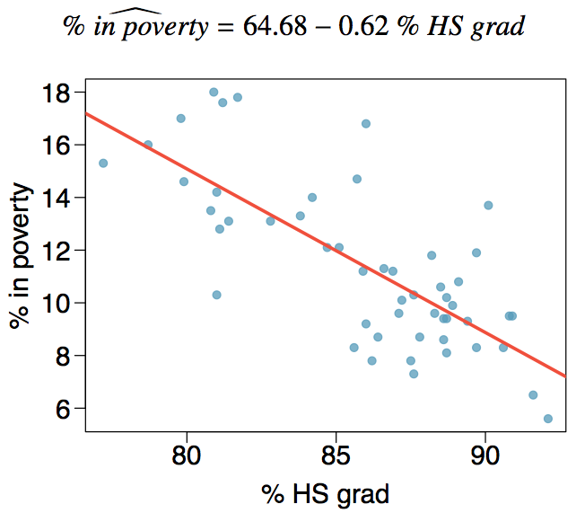
```
</center>


## Interpretation of slope and intercept

<div style = "float:left; position: relative;">
* **Intercept**: when $x=0$, $y$ is expected to equal the intercept
* **Slope**: for each unit change in $x$, $y$ is expected to increase/decrease on average by the value of the slope.
</div>
<div style = "float:right; position: relative;">
```{r, out.width = "450px", echo = FALSE}
knitr::include_graphics("fig/fig_5_2_idealized_reg.png")
```
</div>

**Note**: these statements are **not** causal, unless the study is a randomized controlled experiment.

## Prediction

* Using the linear model to predict the value of the response variable for a given value of the explanatory variable is called **prediction**, and consists of plugging the value of $x$ into the linear model equation
* There will be some uncertainty associated with the predicted value

<center>
```{r, out.width = "750px", echo = FALSE}
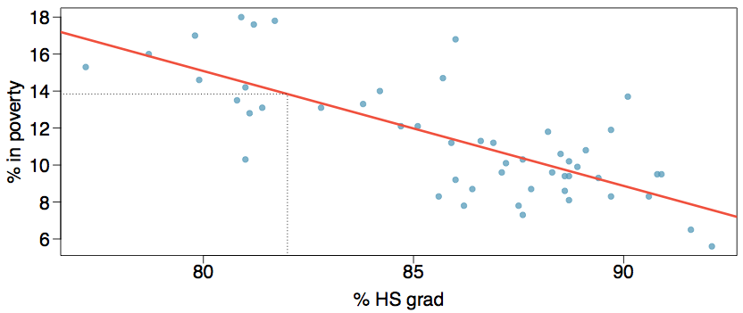
```
</center>

## Extrapolation

* Applying a model estimate to values outside of the range of the original data is called **extrapolation**
* Sometimes the intercept is an extrapolation

<center>
```{r, out.width = "750px", echo = FALSE}

```
</center>

## Examples of Extrapolation

<center>
```{r, out.width = "750px", echo = FALSE}
knitr::include_graphics("fig/fig_5_2_extrap1.png")
```
</center>

## Examples of Extrapolation

<center>
```{r, out.width = "750px", echo = FALSE}
knitr::include_graphics("fig/fig_5_2_extrap2.png")
```
</center>

## Examples of Extrapolation

<center>
```{r, out.width = "750px", echo = FALSE}
knitr::include_graphics("fig/fig_5_2_extrap3.png")
```
</center>

## Conditions for Least Squares Lines

* Linearity

## Conditions for Least Squares Lines

* Linearity
* Nearly normal residuals

## Conditions for Least Squares Lines

* Linearity
* Nearly normal residuals
* Constant variability

## Conditions: (1) Linearity

* the relationships between the explanatory and response variables should be linear

## Conditions: (1) Linearity

* the relationships between the explanatory and response variables should be linear
* methods for fitting a model to non-linear relationships exist, but are mostly beyond the scope of this course

## Conditions: (1) Linearity

* the relationships between the explanatory and response variables should be linear
* methods for fitting a model to non-linear relationships exist, but are mostly beyond the scope of this course
* check using a scatterplot or residual plot of the data (or both)

<center>
```{r, out.width = "550px", echo = FALSE}
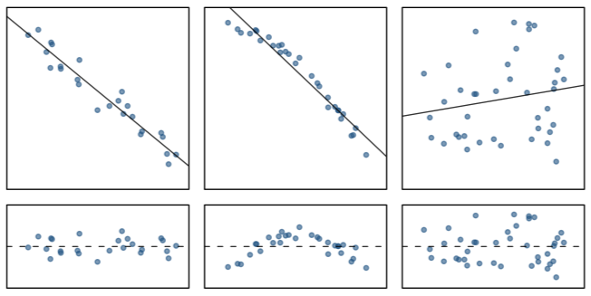
```
</center>

## Anatomy of a residuals plot

<div style = "float:left; position: relative;">
```{r, echo=FALSE, out.width = "450px"}
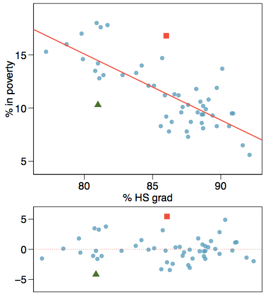
```
</div>
<div style = "float:right;position: relative;">
```{r, echo=FALSE, out.width = "450px"}
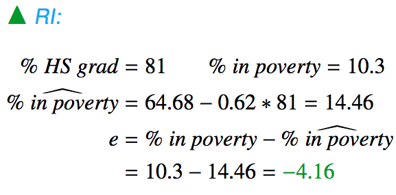
```
</div>


## Anatomy of a residuals plot

<div style = "float:left; position: relative;">
```{r, echo=FALSE, out.width = "450px"}

```
</div>
<div style = "float:right;position: relative;">
```{r, echo=FALSE, out.width = "450px"}
 
```

<br />
```{r, echo=FALSE, out.width = "450px"}
knitr::include_graphics("fig/fig_5_2_anatomy3.png")
```
</div>

## Conditions: (2) Nearly normal residuals

* the residuals should be nearly normal

## Conditions: (2) Nearly normal residuals

* the residuals should be nearly normal
* this condition may not be satisfied when there are unusual observations that don't follow the trend of the rest of the data

## Conditions: (2) Nearly normal residuals

* the residuals should be nearly normal
* this condition may not be satisfied when there are unusual observations that don't follow the trend of the rest of the data
* check using a histogram and/or a normal QQ (probability) plot of the residuals

<center>
```{r, echo=FALSE, out.width = "750px"}
knitr::include_graphics("fig/fig_5_2_residual_full.png")
```
</center>

## Conditions: (3) Constant variability

<div style = "float:left; position: relative;">
```{r, echo=FALSE, out.width = "400px"}
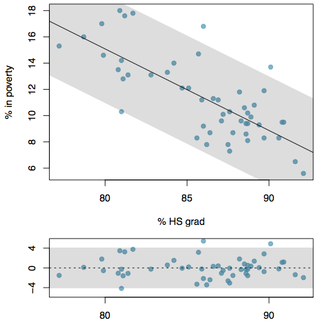
```
</div>
<div style = "float:right;position: relative; display:inline; width:450px;">
* The variability of points around the least squares line should be roughly constant
</div>

## Conditions: (3) Constant variability

<div style = "float:left; position: relative;">
```{r, echo=FALSE, out.width = "400px"}

```
</div>
<div style = "float:right;position: relative; display:inline; width:450px;">
* The variability of points around the least squares line should be roughly constant
* This implies that the variability of the residuals around the $0$ line should be roughly constant as well
</div>

## Conditions: (3) Constant variability

<div style = "float:left; position: relative;">
```{r, echo=FALSE, out.width = "400px"}

```
</div>
<div style = "float:right;position: relative; display:inline; width:450px;">
* The variability of points around the least squares line should be roughly constant
* This implies that the variability of the residuals around the $0$ line should be roughly constant as well
* This is given the technical name **homoscedasticity**
</div>

## Conditions: (3) Constant variability

<div style = "float:left; position: relative;">
```{r, echo=FALSE, out.width = "400px"}

```
</div>
<div style = "float:right;position: relative; display:inline; width:450px;">
* The variability of points around the least squares line should be roughly constant
* This implies that the variability of the residuals around the $0$ line should be roughly constant as well
* This is given the technical name **homoscedasticity**
* Check using a histogram or normal (QQ) probability plot of the residuals
</div>

## Example: Checking Conditions

<div style = "display:inline; float:left; position:relative; width:350px;">
What condition is this linear model 
obviously violating?

* Constant variability
* Linear relationship
* Normal residuals
* No extreme outliers
</div>
<div style = "display:inline; float:right; position:relative;">
```{r, echo=FALSE, out.width = "350px"}
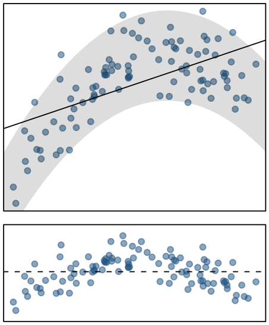
```
</div>

## Example: Checking Conditions

<div style = "display:inline; float:left; position:relative; width:350px;">
What condition is this linear model 
obviously violating?

* Constant variability
* **Linear relationship**
* Normal residuals
* No extreme outliers
</div>
<div style = "display:inline; float:right; position:relative;">
```{r, echo=FALSE, out.width = "350px"}

```
</div>

## Example: Checking Conditions

<div style = "display:inline; float:left; position:relative; width:350px;">
What condition is this linear model 
obviously violating?

* Constant variability
* Linear relationship
* Normal residuals
* No extreme outliers
</div>
<div style = "display:inline; float:right; position:relative;">
```{r, echo=FALSE, out.width = "350px"}
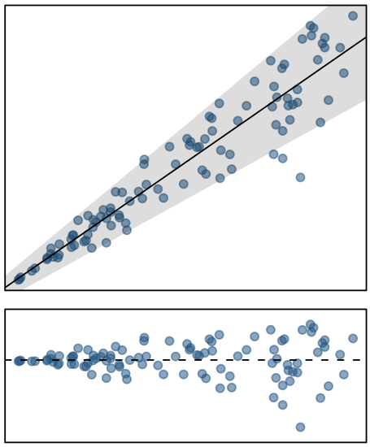
```
</div>

## Example: Checking Conditions

<div style = "display:inline; float:left; position:relative; width:350px;">
What condition is this linear model 
obviously violating?

* **Constant variability**
* Linear relationship
* Normal residuals
* No extreme outliers
</div>
<div style = "display:inline; float:right; position:relative;">
```{r, echo=FALSE, out.width = "350px"}

```
</div>

## $R^2$

* The strength of the fit of a linear model is most commonly evaluated using $R^2$

## $R^2$

* The strength of the fit of a linear model is most commonly evaluated using $R^2$
* $R^2$ is calculated as the square of the correlation coefficient

## $R^2$

* The strength of the fit of a linear model is most commonly evaluated using $R^2$
* $R^2$ is calculated as the square of the correlation coefficient
* It tells us what percentage of the variability in the response variable is explained by the model

## $R^2$

* The strength of the fit of a linear model is most commonly evaluated using $R^2$
* $R^2$ is calculated as the square of the correlation coefficient
* It tells us what percentage of the variability in the response variable is explained by the model
* The remainder of the variability is explained either by variables not included in the model (not known!), or by inherent randomness of the data

## $R^2$

* The strength of the fit of a linear model is most commonly evaluated using $R^2$
* $R^2$ is calculated as the square of the correlation coefficient
* It tells us what percentage of the variability in the response variable is explained by the model
* The remainder of the variability is explained either by variables not included in the model (not known!), or by inherent randomness of the data
* For the model we've been working with, $R^2 = (-0.62)^2 = 0.38$

## Interpretation of $R^2$

Which of the below is the correct interpretation of $R = -0.62, R^2 = 0.38$

<div style = "display:inline; float:left; position:relative; width:550px;">
* 38% of the variability in the % of HG graduates among the 51 states is explained by the model.
* 38% of the variability in the % of residents living in poverty among the 51 states is explained by the model.
* 38% of the time % HS graduates predict % living in poverty correctly.
* 62% of the variability in the % of residents living in poverty among the 51 states is explained by the model.
</div>
<div style = "display:inline; float:right; position:relative;">
```{r, echo=FALSE, out.width = "350px"}
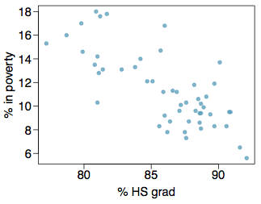
```
</div>

## Interpretation of $R^2$

Which of the below is the correct interpretation of $R = -0.62, R^2 = 0.38$

<div style = "display:inline; float:left; position:relative; width:550px;">
* 38% of the variability in the % of HG graduates among the 51 states is explained by the model.
* **38% of the variability in the % of residents living in poverty among the 51 states is explained by the model.**
* 38% of the time % HS graduates predict % living in poverty correctly.
* 62% of the variability in the % of residents living in poverty among the 51 states is explained by the model.
</div>
<div style = "display:inline; float:right; position:relative;">
```{r, echo=FALSE, out.width = "350px"}

```
</div>

## Poverty versus Region (East, West)

<center>
```{r, echo=FALSE, out.width = "650px"}
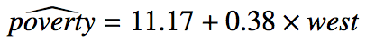
```
</center>

* Explanatory variable: region, *reference level*: east
* **Intercept**: the estimated average poverty percentage in the eastern states is 11.17%
    - This is the value we get if we plug in $0$ for the explanatory variable
    
## Poverty versus Region (East, West)

<center>
```{r, echo=FALSE, out.width = "650px"}

```
</center>

* Explanatory variable: region, *reference level*: east
* **Intercept**: the estimated average poverty percentage in the eastern states is 11.17%
    - This is the value we get if we plug in $0$ for the explanatory variable   
* **Slope**: the estimated average poverty percentage in western states is 0.38% higher than in eastern states  
    - The estimated average poverty percentage in western states is $11.17 + 0.38 = 11.55%$.
    - This is the value we get if we plug in $1$ for the explanatory variable
    
## Poverty versus Region (northeast, midwest, west, south)

Which region (northeast, midwest, west or south) is the reference level?

<center>
```{r, echo=FALSE, out.width = "650px"}
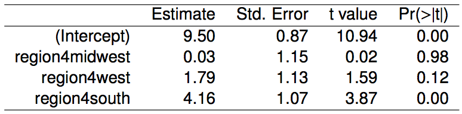
```
</center>

* northeast
* midwest
* west
* south
* cannot tell
    
 ## Poverty versus Region (northeast, midwest, west, south)

Which region (northeast, midwest, west or south) is the reference level?

<center>
```{r, echo=FALSE, out.width = "650px"}

```
</center>

* **northeast**
* midwest
* west
* south
* cannot tell

## Doing Linear Regression in R

(more to come here)
    
<!-- This is Chapter 5.3 in the text, slides by Mine Cetinkaya-Rundel -->


<!-- This is Chapter 5.4 in the text, slides by Mine Cetinkaya-Rundel -->
