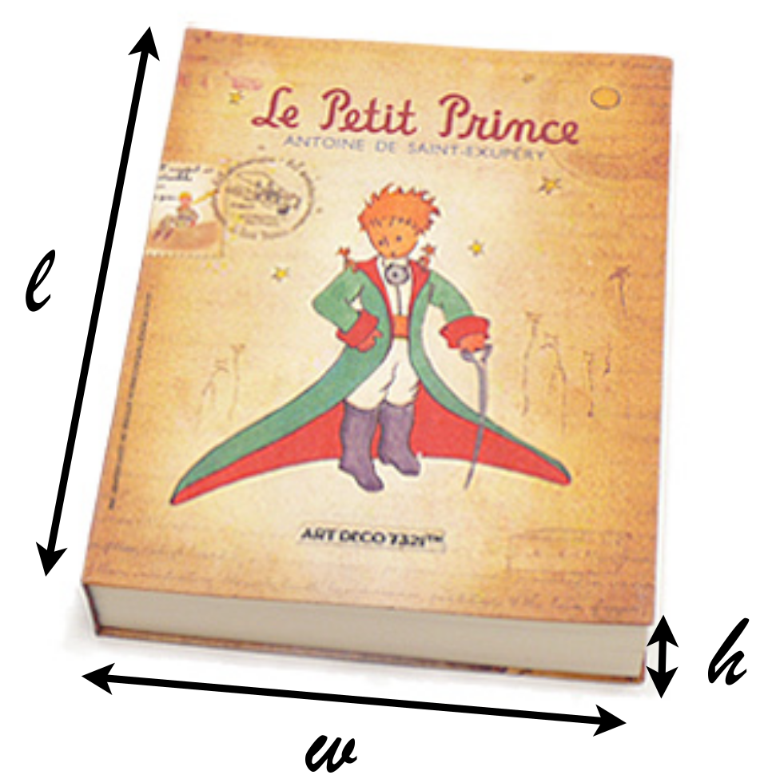
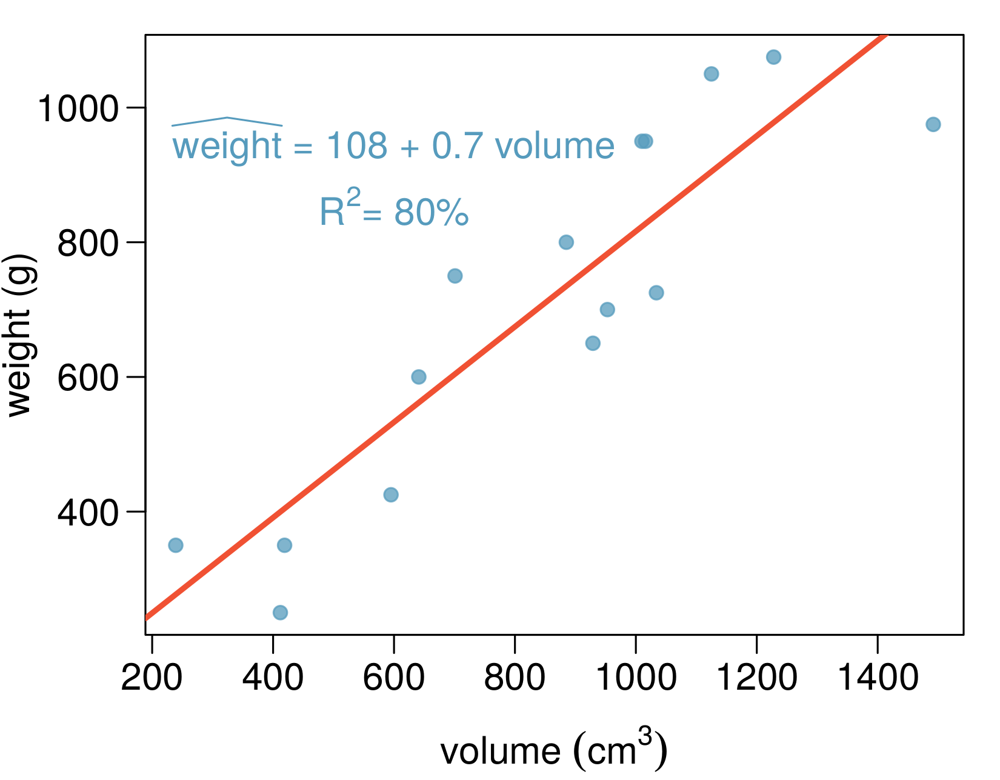
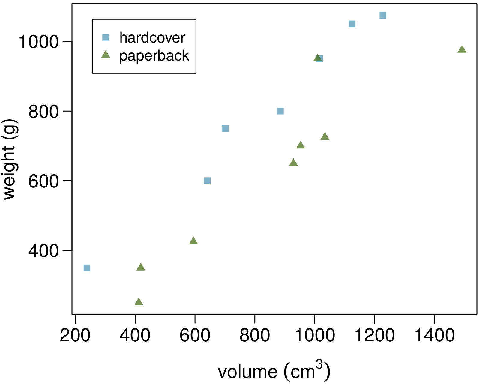
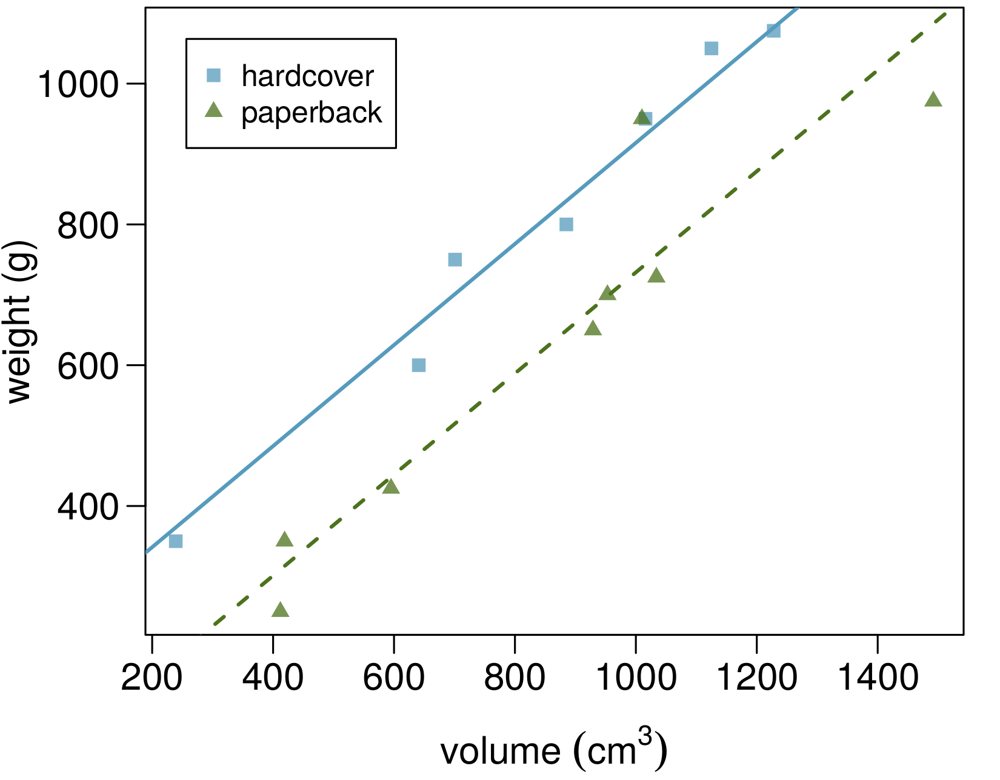
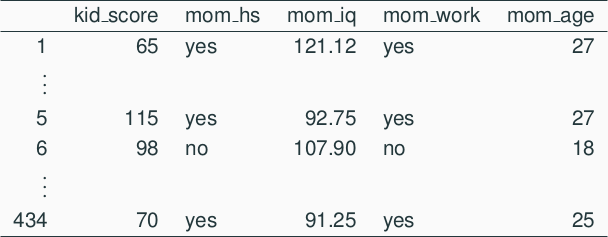
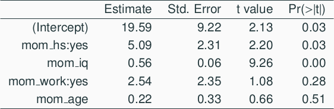
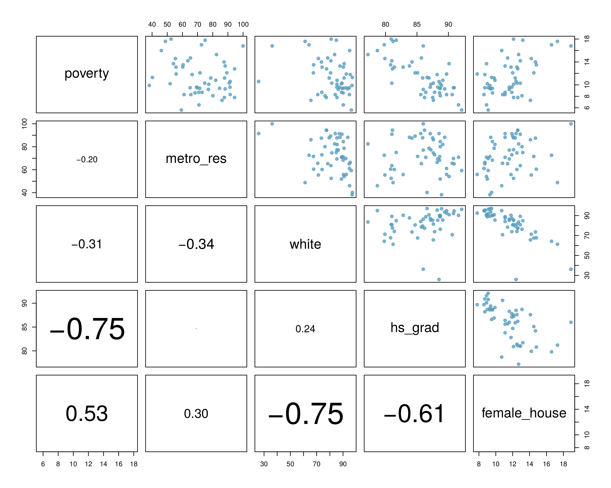
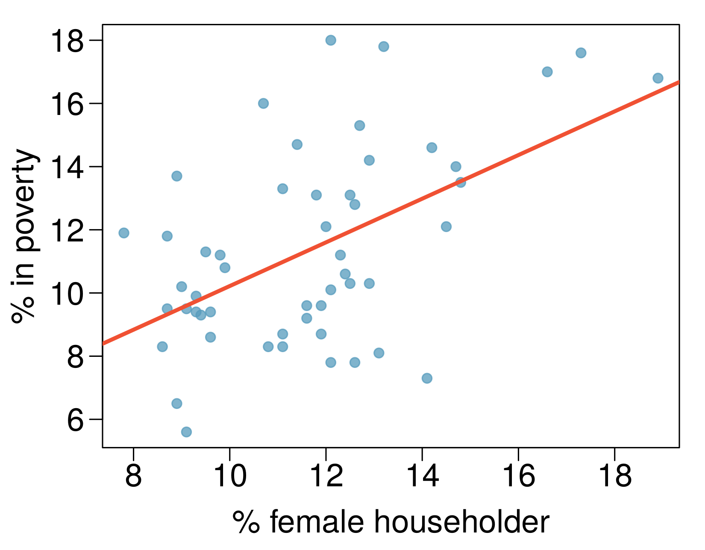

<!--  Version 1.0-0

      This version of the slides is taken directly from Mine Çetinkaya-Rundel's lecture slides
      posted on OpenIntro.org in .pdf and .tex format. Simply moved to Rmd.

      A large part of the HTML/CSS formatting is janky, and could be cleaned up.
      Feel free to issue a  pull request if you love HTML and CSS and want to fix this up.

      - wburr, Nov 20, 2017
-->

<!-- This is Chapter 6.1 in the text, slides by Mine Cetinkaya-Rundel -->

# Introduction to Multiple Regression

## Multiple Regression

* Simple linear regression: Bivariate, two variables: $y$ and $x$
* Multiple linear regression: Multiple variables: $y$ and $x_1$, $x_2$, $\cdots$

## Example: Weights of Books

<div id="left">
```{r, out.width = "350px", echo = FALSE}

```
</div>
<div id="right">
```{r, echo = FALSE, message = FALSE}
library("knitr")
library("kableExtra")
library("openintro")
library(xtable)
library(DAAG)
data(COL)
data(allbacks)
dt <- allbacks[1:10, ]
print(kable(dt))
```
</div>
<span id="footnote">{From: Maindonald, J.H. and Braun, W.J. (2nd ed., 2007) "Data Analysis and Graphics Using R"</span>

## Weight of Books (ctd.) {.smaller}

<div id="left">
The scatterplot shows the relationship between weights and volumes of books, as well as the regression output. Which of the below is correct?

(a) Weights of 80% of the books can be predicted accurately using
this model.
(b) Books that are 10 cm$^3$ over average are expected to weigh 7g
over average.
(c) The correlation between weight and volume is R = 0.80$^2$ = 0.64 .
(d) The model underestimates the weight of the book with the highest volume.

</div>
<div id="right">
```{r, out.width = "350px", echo = FALSE}

```
</div>

## Weight of Books (ctd.) {.smaller}

<div id="left">
The scatterplot shows the relationship between weights and volumes of books, as well as the regression output. Which of the below is correct?

(a) Weights of 80% of the books can be predicted accurately using
this model.
(b) <span id="highlight">Books that are 10 cm$^3$ over average are expected to weigh 7g over average.</span>
(c) The correlation between weight and volume is R = 0.80$^2$ = 0.64 .
(d) The model underestimates the weight of the book with the highest volume.

</div>
<div id="right">
```{r, out.width = "350px", echo = FALSE}

```
</div>

## Modeling weights of books using volume

```{r}
data(allbacks)
fit <- summary( lm(weight ~ volume, data = allbacks) )
```

<pre>
Coefficients:
             Estimate Std. Error t value Pr(>|t|)
(Intercept) 107.67931   88.37758   1.218    0.245
volume        0.70864    0.09746   7.271 6.26e-06

Residual standard error: 123.9 on 13 degrees of freedom
Multiple R-squared: 0.8026,Adjusted R-squared: 0.7875
F-statistic: 52.87 on 1 and 13 DF, p-value: 6.262e-06
</pre>

## Weights of hardcover and paperback books

Can you identify a trend in the relationship between volume and weight of hardcover and paperback books?

<center>
```{r, out.width = "450px", echo = FALSE}

```
</center>

## Weights of hardcover and paperback books

Can you identify a trend in the relationship between volume and weight of hardcover and paperback books?

<span id="highlight">Paperbacks generally weigh less than hardcovers, after controlling for the book's volume.</span>

<center>
```{r, out.width = "450px", echo = FALSE}

```
</center>

## Modeling weights of books using volume **and** cover type


```{r}
data(allbacks)
fit <- summary( lm(weight ~ volume + cover, data = allbacks) )
```

<pre>
Coefficients:
              Estimate Std. Error t value Pr(>|t|)    
(Intercept)  197.96284   59.19274   3.344 0.005841 ** 
volume         0.71795    0.06153  11.669  6.6e-08 ***
coverpb     -184.04727   40.49420  -4.545 0.000672 ***

Residual standard error: 78.2 on 12 degrees of freedom
Multiple R-squared:  0.9275,	Adjusted R-squared:  0.9154 
F-statistic: 76.73 on 2 and 12 DF,  p-value: 1.455e-07
</pre>

## Determining the reference level

Based on the regression output below, which level of $\texttt{cover}$ is the reference level?
Note that $\texttt{pb}$ is paperback.

<pre>
              Estimate Std. Error t value Pr(>|t|)    
(Intercept)  197.96284   59.19274   3.344 0.005841 ** 
volume         0.71795    0.06153  11.669  6.6e-08 ***
coverpb     -184.04727   40.49420  -4.545 0.000672 ***
</pre>

(a) paperback
(b) hardcover

## Determining the reference level

Based on the regression output below, which level of $\texttt{cover}$ is the reference level?
Note that $\texttt{pb}$ is paperback.

<pre>
              Estimate Std. Error t value Pr(>|t|)    
(Intercept)  197.96284   59.19274   3.344 0.005841 
volume         0.71795    0.06153  11.669  6.6e-08 
coverpb     -184.04727   40.49420  -4.545 0.000672 
</pre>

(a) paperback
(b) <span id="highlight">hardcover</span>

## Determining the reference level

Which of the below correctly describes the roles of variables in this regression model?

<pre>
              Estimate Std. Error t value Pr(>|t|)    
(Intercept)  197.96284   59.19274   3.344 0.005841 
volume         0.71795    0.06153  11.669  6.6e-08 
coverpb     -184.04727   40.49420  -4.545 0.000672 
</pre>

(a) response: weight, explanatory: volume, paperback cover
(b) response: weight, explanatory: volume, hardcover cover
(c) response: volume, explanatory: weight, cover type
(d) response: weight, explanatory: volume, cover type

## Determining the reference level

Which of the below correctly describes the roles of variables in this regression model?

<pre>
              Estimate Std. Error t value Pr(>|t|)    
(Intercept)  197.96284   59.19274   3.344 0.005841 
volume         0.71795    0.06153  11.669  6.6e-08 
coverpb     -184.04727   40.49420  -4.545 0.000672 
</pre>

(a) response: weight, explanatory: volume, paperback cover
(b) response: weight, explanatory: volume, hardcover cover
(c) response: volume, explanatory: weight, cover type
(d) <span id="highlight">response: weight, explanatory: volume, cover type</span>

## Linear Model {.smaller}

<pre>
              Estimate Std. Error t value Pr(>|t|)    
(Intercept)  197.96284   59.19274   3.344 0.005841 
volume         0.71795    0.06153  11.669  6.6e-08 
coverpb     -184.04727   40.49420  -4.545 0.000672 
</pre>

<center>
$$
\hat{\text{weight}} = 197.96 + 0.72 \cdot \text{volume} - 184.05 \cdot \text{coverpb}
$$
</center>

## Linear Model {.smaller}

<pre>
              Estimate Std. Error t value Pr(>|t|)    
(Intercept)  197.96284   59.19274   3.344 0.005841 
volume         0.71795    0.06153  11.669  6.6e-08 
coverpb     -184.04727   40.49420  -4.545 0.000672 
</pre>

<center>
$$
\hat{\text{weight}} = 197.96 + 0.72 \cdot \text{volume} - 184.05 \cdot \text{coverpb}
$$
</center>

1. For <span id="highlight">hardcover</span> books, plug in **0** for $\texttt{cover}$
<center>
$$
\begin{split}
\hat{\text{weight}} &= 197.96 + 0.72 \cdot \text{volume} - 184.05 \cdot 0 \\
\end{split}
$$
</center>


## Linear Model {.smaller}

<pre>
              Estimate Std. Error t value Pr(>|t|)    
(Intercept)  197.96284   59.19274   3.344 0.005841 
volume         0.71795    0.06153  11.669  6.6e-08 
coverpb     -184.04727   40.49420  -4.545 0.000672 
</pre>

<center>
$$
\hat{\text{weight}} = 197.96 + 0.72 \cdot \text{volume} - 184.05 \cdot \text{coverpb}
$$
</center>

1. For <span id="highlight">hardcover</span> books, plug in **0** for $\texttt{cover}$
<center>
$$
\begin{split}
\hat{\text{weight}} &= 197.96 + 0.72 \cdot \text{volume} - 184.05 \cdot 0 \\
                    &= 197.96 + 0.72 \cdot \text{volume} 
\end{split}
$$
</center>


## Linear Model {.smaller}

<pre>
              Estimate Std. Error t value Pr(>|t|)    
(Intercept)  197.96284   59.19274   3.344 0.005841 
volume         0.71795    0.06153  11.669  6.6e-08 
coverpb     -184.04727   40.49420  -4.545 0.000672 
</pre>

<center>
$$
\hat{\text{weight}} = 197.96 + 0.72 \cdot \text{volume} - 184.05 \cdot \text{coverpb}
$$
</center>

1. For <span id="highlight">hardcover</span> books, plug in **0** for $\texttt{cover}$
<center>
$$
\begin{split}
\hat{\text{weight}} &= 197.96 + 0.72 \cdot \text{volume} - 184.05 \cdot 0 \\
                    &= 197.96 + 0.72 \cdot \text{volume} 
\end{split}
$$
</center>

2. For <span id="hightlight">paperback</span> books, plug in **1** for $\texttt{cover}$
<center>
$$
\begin{split}
\hat{\text{weight}} &= 197.96 + 0.72 \cdot \text{volume} - 184.05 \cdot 1 \\
\end{split}
$$
</center>

## Linear Model {.smaller}

<pre>
              Estimate Std. Error t value Pr(>|t|)    
(Intercept)  197.96284   59.19274   3.344 0.005841 
volume         0.71795    0.06153  11.669  6.6e-08 
coverpb     -184.04727   40.49420  -4.545 0.000672 
</pre>

<center>
$$
\hat{\text{weight}} = 197.96 + 0.72 \cdot \text{volume} - 184.05 \cdot \text{coverpb}
$$
</center>

1. For <span id="highlight">hardcover</span> books, plug in **0** for $\texttt{cover}$
<center>
$$
\begin{split}
\hat{\text{weight}} &= 197.96 + 0.72 \cdot \text{volume} - 184.05 \cdot 0 \\
                    &= 197.96 + 0.72 \cdot \text{volume} 
\end{split}
$$
</center>

2. For <span id="hightlight">paperback</span> books, plug in **1** for $\texttt{cover}$
<center>
$$
\begin{split}
\hat{\text{weight}} &= 197.96 + 0.72 \cdot \text{volume} - 184.05 \cdot 1 \\
                    &= 13.91 + 0.72 \cdot \text{volume} 
\end{split}
$$
</center>

## Visualizing the linear model

<center>
```{r, out.width = "550px", echo = FALSE}

```
</center>

## Interpretation of the regression coefficients

<pre>
              Estimate Std. Error t value Pr(>|t|)    
(Intercept)  197.96284   59.19274   3.344 0.005841 
volume         0.71795    0.06153  11.669  6.6e-08 
coverpb     -184.04727   40.49420  -4.545 0.000672 
</pre>

## Interpretation of the regression coefficients

<pre>
              Estimate Std. Error t value Pr(>|t|)    
(Intercept)  197.96284   59.19274   3.344 0.005841 
volume         0.71795    0.06153  11.669  6.6e-08 
coverpb     -184.04727   40.49420  -4.545 0.000672 
</pre>

* <span id="highlight">Slope of volume</span>: All else held constant, books that are 1 more
cubic centimeter in volume tend to weigh about 0.72 grams
more.

## Interpretation of the regression coefficients

<pre>
              Estimate Std. Error t value Pr(>|t|)    
(Intercept)  197.96284   59.19274   3.344 0.005841 
volume         0.71795    0.06153  11.669  6.6e-08 
coverpb     -184.04727   40.49420  -4.545 0.000672 
</pre>

* <span id="highlight">Slope of volume</span>: All else held constant, books that are 1 more
cubic centimeter in volume tend to weigh about 0.72 grams
more.
* <span id="highlight">Slope of cover</span>: All else held constant, the model predicts that
paperback books weigh 184 grams lower than hardcover
books.

## Interpretation of the regression coefficients

<pre>
              Estimate Std. Error t value Pr(>|t|)    
(Intercept)  197.96284   59.19274   3.344 0.005841 
volume         0.71795    0.06153  11.669  6.6e-08 
coverpb     -184.04727   40.49420  -4.545 0.000672 
</pre>

* <span id="highlight">Slope of volume</span>: All else held constant, books that are 1 more
cubic centimeter in volume tend to weigh about 0.72 grams
more.
* <span id="highlight">Slope of cover</span>: All else held constant, the model predicts that
paperback books weigh 184 grams lower than hardcover
books.
* <span id="highlight">Intercept</span>: Hardcover books with no volume are expected on
average to weigh 198 grams.

## Interpretation of the regression coefficients

<pre>
              Estimate Std. Error t value Pr(>|t|)    
(Intercept)  197.96284   59.19274   3.344 0.005841 
volume         0.71795    0.06153  11.669  6.6e-08 
coverpb     -184.04727   40.49420  -4.545 0.000672 
</pre>

* <span id="highlight">Slope of volume</span>: All else held constant, books that are 1 more
cubic centimeter in volume tend to weigh about 0.72 grams
more.
* <span id="highlight">Slope of cover</span>: All else held constant, the model predicts that
paperback books weigh 184 grams lower than hardcover
books.
* <span id="highlight">Intercept</span>: Hardcover books with no volume are expected on
average to weigh 198 grams.
    - Obviously, the intercept does not make sense in context. It only serves to adjust the height of the line.

## Prediction

Which of the following is the correct calculation for the predicted weight of a paperback book that is 600 cm$^3$?

<pre>
              Estimate Std. Error t value Pr(>|t|)    
(Intercept)  197.96284   59.19274   3.344 0.005841 
volume         0.71795    0.06153  11.669  6.6e-08 
coverpb     -184.04727   40.49420  -4.545 0.000672 
</pre>

(a) 197.96 + 0.72 * 600 - 184.05 * 1
(b) 184.05 + 0.72 * 600 - 197.96 * 1
(c) 197.96 + 0.72 * 600 - 184.05 * 0
(d) 197.96 + 0.72 * 1 - 184.05 * 600

## Prediction

Which of the following is the correct calculation for the predicted weight of a paperback book that is 600 cm$^3$?

<pre>
              Estimate Std. Error t value Pr(>|t|)    
(Intercept)  197.96284   59.19274   3.344 0.005841 
volume         0.71795    0.06153  11.669  6.6e-08 
coverpb     -184.04727   40.49420  -4.545 0.000672 
</pre>

(a) <span id="highlight">197.96 + 0.72 * 600 - 184.05 * 1</span>
(b) 184.05 + 0.72 * 600 - 197.96 * 1
(c) 197.96 + 0.72 * 600 - 184.05 * 0
(d) 197.96 + 0.72 * 1 - 184.05 * 600

## Another example: Modeling children's test scores

Predicting cognitive test scores of three- and four-year-old children
using characteristics of their mothers. Data are from a survey of
adult American women and their children - a subsample from the
National Longitudinal Survey of Youth.

<center>
```{r, out.width = "550px", echo = FALSE}

```
</center>
<span id="footnote">Gelman & Hill. Data Analysis Using Regression and Multilevel/Hierarchical Models. (2007) Cambridge University Press.</span>

## Interpreting the slope

What is the correct interpretation of the **slope for mom's IQ?**


<center>
```{r, out.width = "550px", echo = FALSE}

```
</center>

## Interpreting the slope

What is the correct interpretation of the **slope for mom's IQ?**

<center>
```{r, out.width = "550px", echo = FALSE}

```
</center>

<p />

All else held constant, kids with mothers whose IQs are one point
higher tend to score on average 0.56 points higher.

## Interpretation

What is the correct interpretation of the **intercept**?

<center>
```{r, out.width = "550px", echo = FALSE}

```
</center>

## Interpretation

What is the correct interpretation of the **intercept**?

<center>
```{r, out.width = "550px", echo = FALSE}

```
</center>

<p />

Kids whose moms haven’t gone to HS, did not work during the first
three years of the kid’s life, have an IQ of 0 and are 0 yrs old are
expected on average to score 19.59 on an IQ test. Obviously, the intercept does
not make any sense in context.

## Interpretation

What is the correct interpretation of the **slope for $\texttt{mom_work}$**?

<center>
```{r, out.width = "550px", echo = FALSE}

```
</center>

All else being equal, kids whose moms worked during the first three years of the kids life:

(a) are estimated to score 2.54 points lower
(b) are estimated to score 2.54 points higher

than those whose moms did not work.

## Interpretation

What is the correct interpretation of the **slope for $\texttt{mom_work}$**?

<center>
```{r, out.width = "550px", echo = FALSE}

```
</center>

All else being equal, kids whose moms worked during the first three years of the kids life:

(a) are estimated to score 2.54 points lower
(b) <span id="highlight">are estimated to score 2.54 points higher</span>

than those whose moms did not work.

## Revisit: Modeling poverty

<center>
```{r, out.width = "650px", echo = FALSE}

```
</center>

## Revisit: Modeling poverty

<center>
```{r, out.width = "650px", echo = FALSE}

```
</center>

<div id="left">
<center>
```{r, out.width = "450px", echo = FALSE}

```
</center>
</div>
<div id="right">
$$
\begin{split}
R &= 0.53 \\
R^2 &= 0.53^2 = 0.28
\end{split}
$$
</div>

## Another look at $R^2$

$R^2$ can be calculated in three ways:

## Another look at $R^2$

$R^2$ can be calculated in three ways:

1. square the correlation coefficient of $x$ and $y$ (how we have been calculating it) 

## Another look at $R^2$

$R^2$ can be calculated in three ways:

1. square the correlation coefficient of $x$ and $y$ (how we have been calculating it) 
2. square the correlation coefficient of $y$ and $\hat{y}$

## Another look at $R^2$

$R^2$ can be calculated in three ways:

1. square the correlation coefficient of $x$ and $y$ (how we have been calculating it) 
2. square the correlation coefficient of $y$ and $\hat{y}$
3. based on definition:
<center>
$$
R^2 = \frac{\text{explained variability in $y$}}{\text{total variability in $y$}}
$$
</center>

<!-- This is Chapter 6.2 in the text, slides by Mine Cetinkaya-Rundel -->

<!-- This is Chapter 6.3 in the text, slides by Mine Cetinkaya-Rundel -->

<!-- This is Chapter 6.4 in the text, slides by Mine Cetinkaya-Rundel -->
